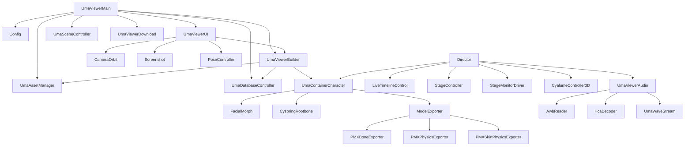

# UmaViewer 项目索引与代码引用关系

UmaViewer 是一个基于 Unity 2022.3 与通用渲染管线（URP）构建的专用客户端工程，主要用于解密、加载、组装、渲染以及导出《赛马娘 Pretty Derby》（Umamusume Pretty Derby）的游戏资源。项目包含对游戏官方专有的资源打包格式、SQLite 数据库、CySpring 次世代物理弹簧骨骼、Cutt 切镜与 Live 舞台演出时间轴、CriWare 音频容器与 HCA 解码、以及 PMX 模型导出等全套逆向与重构实现。

为了让开发者能够快速建立全局认知并理清调用链路，本索引梳理了整个项目的核心架构分层、各关键脚本的功能职责，以及脚本之间的直接引用与依赖拓扑。

## 核心架构分层与数据流转

整个系统的运作流程围绕着数据获取、资源解密、实体装配、舞台调度与渲染展现这一主线展开。

游戏首先在 [Version2.unity](file:///c:/Users/JuziD/proj/umaviewer/UmaViewer/Assets/Scenes/Version2.unity) 场景中由单例管理器 [UmaViewerMain.cs](file:///c:/Users/JuziD/proj/umaviewer/UmaViewer/Assets/Scripts/UmaViewerMain.cs) 启动。在初始化阶段，主管理器首先通过 [Config.cs](file:///c:/Users/JuziD/proj/umaviewer/UmaViewer/Assets/Scripts/Config.cs) 读取用户的路径与运行环境偏好，随后驱动 [UmaDatabaseController.cs](file:///c:/Users/JuziD/proj/umaviewer/UmaViewer/Assets/Scripts/UmaDatabase/UmaDatabaseController.cs) 连接游戏本地的 master.mdb 与 meta 数据库，完成全量马娘角色、服装、Live 曲目与音频分轨等元数据的反序列化。

在用户通过 [UmaViewerUI.cs](file:///c:/Users/JuziD/proj/umaviewer/UmaViewer/Assets/Scripts/UmaViewerUI.cs) 选择特定角色或演出曲目后，UI 层向 [UmaViewerBuilder.cs](file:///c:/Users/JuziD/proj/umaviewer/UmaViewer/Assets/Scripts/UmaViewerBuilder.cs) 发出构建请求。构建器向底层资源调度中枢 [UmaAssetManager.cs](file:///c:/Users/JuziD/proj/umaviewer/UmaViewer/Assets/Scripts/UmaAssetManager.cs) 请求对应的 AssetBundle。资源管理器在加载过程中借助 [UmaAssetBundleStream.cs](file:///c:/Users/JuziD/proj/umaviewer/UmaViewer/Assets/Scripts/UmaAssetBundleStream.cs) 完成流级解密，并将模型预制体、贴图、材质与着色器载入内存。

拿到资源后，[UmaViewerBuilder.cs](file:///c:/Users/JuziD/proj/umaviewer/UmaViewer/Assets/Scripts/UmaViewerBuilder.cs) 会动态拼装马娘身体、头部、发型及尾巴的网格骨骼层级，挂载并初始化角色宿主 [UmaContainerCharacter.cs](file:///c:/Users/JuziD/proj/umaviewer/UmaViewer/Assets/Scripts/UmaContainerCharacter.cs)。角色容器进一步装配表情形变系统 [FacialMorph.cs](file:///c:/Users/JuziD/proj/umaviewer/UmaViewer/Assets/Scripts/umamusume/Gallop/Face/FacialMorph.cs) 以及 Cygames 专属的物理弹簧骨骼解算器 [CyspringRootbone.cs](file:///c:/Users/JuziD/proj/umaviewer/UmaViewer/Assets/Scripts/umamusume/Gallop/Cyspring/CyspringRootbone.cs)。

当进入 Live 演出模式时，系统切换至由 [UmaViewerBuilder.Live.cs](file:///c:/Users/JuziD/proj/umaviewer/UmaViewer/Assets/Scripts/UmaViewerBuilder.Live.cs) 搭建的舞台环境，并由最高调度器 [Director.cs](file:///c:/Users/JuziD/proj/umaviewer/UmaViewer/Assets/Scripts/umamusume/Gallop/Live/Director.cs) 接管运行。Director 会启动 [LiveTimelineControl.cs](file:///c:/Users/JuziD/proj/umaviewer/UmaViewer/Assets/Scripts/umamusume/Gallop/Live/Cutt/LiveTimelineControl.cs) 对 Cutt 切镜时间轴数据进行帧步进，同步驱动舞台灯光 [StageController.cs](file:///c:/Users/JuziD/proj/umaviewer/UmaViewer/Assets/Scripts/umamusume/Gallop/Live/StageController.cs)、巨幕投影 [StageMonitorDriver.cs](file:///c:/Users/JuziD/proj/umaviewer/UmaViewer/Assets/Scripts/umamusume/Gallop/Live/Monitor/StageMonitorDriver.cs)、观众席荧光棒阵列 [CyalumeController3D.cs](file:///c:/Users/JuziD/proj/umaviewer/UmaViewer/Assets/Scripts/umamusume/Gallop/Live/Cyalume/CyalumeController3D.cs)，并协同音频控制器 [UmaViewerAudio.cs](file:///c:/Users/JuziD/proj/umaviewer/UmaViewer/Assets/Scripts/UmaViewerAudio.cs) 实现声画严格同步。

在导出或编辑场景中，[ModelExporter.cs](file:///c:/Users/JuziD/proj/umaviewer/UmaViewer/Assets/Scripts/Exporters/ModelExporter.cs) 会截取运行时角色骨骼、材质与物理参数，转换并导出为标准 MMD PMX 模型；[PoseController.cs](file:///c:/Users/JuziD/proj/umaviewer/UmaViewer/Assets/Scripts/Pose/PoseController.cs) 则负责运行时的姿态调整与骨骼微调。

## 模块划分与核心脚本职责

### 核心管理与生命周期层

主管理层负责整个应用的基础设施初始化、全局单例维护以及错误拦截。

[UmaViewerMain.cs](file:///c:/Users/JuziD/proj/umaviewer/UmaViewer/Assets/Scripts/UmaViewerMain.cs) 作为全局启动单例 `UmaViewerMain.Instance`，挂载在主场景中。它在启动时依次拉起配置、资源管理、UI 视图与场景控制器，管理跨模块的协同协程，并支持在 PC 端接收外部文件的拖拽输入。其直接依赖了 [Config.cs](file:///c:/Users/JuziD/proj/umaviewer/UmaViewer/Assets/Scripts/Config.cs)、[UmaAssetManager.cs](file:///c:/Users/JuziD/proj/umaviewer/UmaViewer/Assets/Scripts/UmaAssetManager.cs)、[UmaViewerBuilder.cs](file:///c:/Users/JuziD/proj/umaviewer/UmaViewer/Assets/Scripts/UmaViewerBuilder.cs)、[UmaViewerUI.cs](file:///c:/Users/JuziD/proj/umaviewer/UmaViewer/Assets/Scripts/UmaViewerUI.cs) 以及 [UmaViewerDownload.cs](file:///c:/Users/JuziD/proj/umaviewer/UmaViewer/Assets/Scripts/UmaViewerDownload.cs)。

[Config.cs](file:///c:/Users/JuziD/proj/umaviewer/UmaViewer/Assets/Scripts/Config.cs) 负责本地持久化配置的管理，包括游戏数据库所在路径 `DbPath`、工作模式 `WorkMode`（Default 或 Custom）、区服 `Region`（日服/韩服/国际服）、着色器全局属性、语言本地化以及 PMX 导出参数。该类被全工程多达 38 个脚本读取，是整个项目的配置根基。

[UmaViewerUI.cs](file:///c:/Users/JuziD/proj/umaviewer/UmaViewer/Assets/Scripts/UmaViewerUI.cs) 集中控制桌面界面的绝大多数窗口与交互控件，涵盖角色选择器、Live 演出曲目选择器、服装替换面板、材质与骨骼属性滑块、截屏面板以及设置界面。该类向下调用 [UmaViewerBuilder.cs](file:///c:/Users/JuziD/proj/umaviewer/UmaViewer/Assets/Scripts/UmaViewerBuilder.cs) 发起角色装配，并在状态变化时同步给 [CameraOrbit.cs](file:///c:/Users/JuziD/proj/umaviewer/UmaViewer/Assets/Scripts/CameraOrbit.cs) 与各子系统。

[UmaErrorManager.cs](file:///c:/Users/JuziD/proj/umaviewer/UmaViewer/Assets/Scripts/UmaErrorManager.cs) 与 [UmaGlobalErrorToast.cs](file:///c:/Users/JuziD/proj/umaviewer/UmaViewer/Assets/Scripts/UmaGlobalErrorToast.cs) 共同构成了系统的容错机制。错误管理器挂载在全局异常捕获钩子上，统一收集资源加载失败、切镜缺失或材质丢失等警告，并调用吐司组件在屏幕上方显示平滑淡入淡出的提示信息，避免因为个别资源异常导致整个程序闪退。

### 资源加载与数据库访问层

资源层屏蔽了赛马娘官方资产的物理存储差异，提供了统一的解密与同步/异步资源供给通道。

[UmaAssetManager.cs](file:///c:/Users/JuziD/proj/umaviewer/UmaViewer/Assets/Scripts/UmaAssetManager.cs) 作为资源管理单例 `UmaAssetManager.Instance`，负责所有 AssetBundle 的生命周期管理。它维护了已加载包的句柄缓存与引用计数，支持通过内部结构 `LoadItem` 进行批量异步加载。在读取受加密保护的 bundle 时，它会调用 [UmaAssetBundleStream.cs](file:///c:/Users/JuziD/proj/umaviewer/UmaViewer/Assets/Scripts/UmaAssetBundleStream.cs) 进行内存流解密，该流继承自 System.IO.Stream，内部结合 [AssetBundleDecryptor.cs](file:///c:/Users/JuziD/proj/umaviewer/UmaViewer/Assets/Scripts/AssetBundleDecryptor.cs) 实现了快速的逐块异或解密。

[UmaDatabaseController.cs](file:///c:/Users/JuziD/proj/umaviewer/UmaViewer/Assets/Scripts/UmaDatabase/UmaDatabaseController.cs) 是连接 SQLite 数据库的桥梁。它读取由游戏客户端生成的 master.mdb 文件，从中解析出马娘角色基础档案、角色衣装对照表、技能演出和 Live 歌曲信息，并填充到 [UmaDataTypes.cs](file:///c:/Users/JuziD/proj/umaviewer/UmaViewer/Assets/Scripts/UmaDatabase/UmaDataTypes.cs) 定义的数据结构中，供 UI 展示和装配工厂检索。

[UmaViewerDownload.cs](file:///c:/Users/JuziD/proj/umaviewer/UmaViewer/Assets/Scripts/UmaViewerDownload.cs) 则提供了针对未下载资源的在线补全通道，能够依据 manifest 从官方 CDN 下载缺失的数据块并保存至本地缓存。

### 实体组装与角色容器层

该层将离散的模型网格、贴图、骨骼配置组装成可交互的 Unity 游戏对象。

[UmaViewerBuilder.cs](file:///c:/Users/JuziD/proj/umaviewer/UmaViewer/Assets/Scripts/UmaViewerBuilder.cs) 是角色模型生成的工厂单例。它根据数据库中的服装和发型信息，分步拉取身体（bdy）、头部（hed）、发型（hair）和道具网格，通过骨骼重定向将各部件绑定到统一的主骨架上，并自动替换与配置赛马娘专用的卡通着色材质。针对 Live 演出的特化构建逻辑则拆分存放在 [UmaViewerBuilder.Live.cs](file:///c:/Users/JuziD/proj/umaviewer/UmaViewer/Assets/Scripts/UmaViewerBuilder.Live.cs) 中，负责舞台场景实体生成、多角色站位初始化以及摄像机轨道绑定。

[UmaContainerCharacter.cs](file:///c:/Users/JuziD/proj/umaviewer/UmaViewer/Assets/Scripts/UmaContainerCharacter.cs) 是挂载在每个马娘模型根节点上的核心容器。它集中持有了角色的各个渲染网格 Renderer、骨骼 Transform、表情控制器、动态骨骼组件以及动画控制器 Animation。它提供了诸如切换服装、改变发型、微调身体比例、开关部件可见性以及换装配件等一系列高层接口。针对手持道具和附加配件的动态挂接逻辑被拆分维护在 [UmaContainerCharacter.Props.cs](file:///c:/Users/JuziD/proj/umaviewer/UmaViewer/Assets/Scripts/UmaContainerCharacter.Props.cs) 中。

[UmaContainer.cs](file:///c:/Users/JuziD/proj/umaviewer/UmaViewer/Assets/Scripts/UmaContainer.cs) 与 [UmaContainerProp.cs](file:///c:/Users/JuziD/proj/umaviewer/UmaViewer/Assets/Scripts/UmaContainerProp.cs) 则分别充当基础容器抽象类与独立道具对象的挂载容器。

### Live 演出调度与舞台系统

Live 模块是 UmaViewer 最复杂、联动最深的子系统，完整还原了 Cygames 官方的演出编排引擎。

[Director.cs](file:///c:/Users/JuziD/proj/umaviewer/UmaViewer/Assets/Scripts/umamusume/Gallop/Live/Director.cs) 是整个舞台演出的核心调度中枢。它维护了当前演出的全部状态，包括当前时间戳 `_liveCurrentTime`、参加演出的角色容器列表 `CharaContainerScript`、音频源实例 `liveMusic` 与分轨人声 `liveVocal`。在每帧更新时，Director 计算出音频对齐的时间戳，并依次通知切镜控制器、舞台控制器以及角色容器进行姿态与表情的更新。

[LiveTimelineControl.cs](file:///c:/Users/JuziD/proj/umaviewer/UmaViewer/Assets/Scripts/umamusume/Gallop/Live/Cutt/LiveTimelineControl.cs) 与 [LiveTimelineData.cs](file:///c:/Users/JuziD/proj/umaviewer/UmaViewer/Assets/Scripts/umamusume/Gallop/Live/Cutt/LiveTimelineData.cs) 负责切镜数据的反序列化与播放。Live 演出采用 Cutt 序列化格式，包含主摄像机运动轨迹、注视目标、各机位切换、角色的口型动画（LipSync）、面部表情、灯光变化以及特定物体的可见性事件，这些都在该控制器的调度下分发到对应的更新器中。

[StageController.cs](file:///c:/Users/JuziD/proj/umaviewer/UmaViewer/Assets/Scripts/umamusume/Gallop/Live/StageController.cs) 及其伴随的分部类负责舞台灯光体系，包括聚光灯扫射、激光矩阵（Laser）、背景色彩调和以及实时镜面反射。

[StageMonitorDriver.cs](file:///c:/Users/JuziD/proj/umaviewer/UmaViewer/Assets/Scripts/umamusume/Gallop/Live/Monitor/StageMonitorDriver.cs) 协同 [MonitorUvMovieProvider.cs](file:///c:/Users/JuziD/proj/umaviewer/UmaViewer/Assets/Scripts/umamusume/Gallop/Live/Monitor/MonitorUvMovieProvider.cs) 实现了舞台背景巨大屏幕的渲染，能够将游戏内的动态切片视频或者实时摄像机画面贴合到舞台大屏材质上。

[CyalumeController3D.cs](file:///c:/Users/JuziD/proj/umaviewer/UmaViewer/Assets/Scripts/umamusume/Gallop/Live/Cyalume/CyalumeController3D.cs) 负责观众席荧光棒的生成与律动。它依据时间轴中的打 call 数据实时切换荧光棒配色，驱动大范围点阵摇晃，并配合 [MobShadowController.cs](file:///c:/Users/JuziD/proj/umaviewer/UmaViewer/Assets/Scripts/umamusume/Gallop/Live/Cyalume/MobShadowController.cs) 投射出逼真的观众人潮暗影。

### 专用物理与面部表情驱动

马娘特有的马耳、尾巴与发型动态，由 Cygames 自研的 CySpring 物理引擎驱动。

[CyspringRootbone.cs](file:///c:/Users/JuziD/proj/umaviewer/UmaViewer/Assets/Scripts/umamusume/Gallop/Cyspring/CyspringRootbone.cs) 是物理骨骼的解算核心。它挂载于角色骨架的根部，基于牛顿力学、弹簧张力以及角动量算法模拟各级次级骨骼在运动过程中的惯性与摆动。同时，它结合了 [CyspringCollisionData.cs](file:///c:/Users/JuziD/proj/umaviewer/UmaViewer/Assets/Scripts/umamusume/Gallop/Cyspring/CyspringCollisionData.cs) 中定义的碰撞体胶囊与碰撞球，防止马尾和裙摆穿模。

[FacialMorph.cs](file:///c:/Users/JuziD/proj/umaviewer/UmaViewer/Assets/Scripts/umamusume/Gallop/Face/FacialMorph.cs) 负责角色的面部形态插值。赛马娘的面部表情并非完全依赖骨骼，而是融合了 BlendShape 网格变形与眼部、眉毛的材质 UV 移动。[FacialMorph.cs](file:///c:/Users/JuziD/proj/umaviewer/UmaViewer/Assets/Scripts/umamusume/Gallop/Face/FacialMorph.cs) 为上层提供了统一的权重控制通道，既能被 Live 的 LipSync 歌词口型驱动，也能在 UI 面板由用户手动滑动调整。

### 音频容器解析与解码流

项目内置了完整的音频逆向解包与流式播放支持，摆脱了对外部解码运行时的依赖。

[UmaViewerAudio.cs](file:///c:/Users/JuziD/proj/umaviewer/UmaViewer/Assets/Scripts/UmaViewerAudio.cs) 作为音频管理器，实现了多音轨同步播放器。在 Live 演出中，每位出场马娘都拥有独立的伴奏与单独录制的人声声轨，该管理器负责加载并协调伴奏源 `liveMusic` 与各站位的人声音频源 `liveVocal`，保证在暂停、跳跃进度或改变站位时音画无缝衔接。

在底层格式层面，[AcbReader.cs](file:///c:/Users/JuziD/proj/umaviewer/UmaViewer/Assets/Scripts/Audio/CriWareFormats/AcbReader.cs) 与 [AwbReader.cs](file:///c:/Users/JuziD/proj/umaviewer/UmaViewer/Assets/Scripts/Audio/CriWareFormats/AwbReader.cs) 负责解析 CRIWARE 的声音归档容器，逐一提取出嵌入的 HCA 音频数据流。[HcaDecoder.cs](file:///c:/Users/JuziD/proj/umaviewer/UmaViewer/Assets/Scripts/Audio/ClHcaSharp/HcaDecoder.cs) 作为纯托管 C# 的 HCA 解码器，负责解密并解码高压缩比的音频帧，最终由 [UmaWaveStream.cs](file:///c:/Users/JuziD/proj/umaviewer/UmaViewer/Assets/Scripts/Audio/UmaWaveStream.cs) 包装为 Unity AudioSource 可直接消耗的标准 PCM 采样流。

### PMX 导出与摆拍工具

该模块用于将游戏内的动态模型导出到外部三维与 MMD 软件中。

[ModelExporter.cs](file:///c:/Users/JuziD/proj/umaviewer/UmaViewer/Assets/Scripts/Exporters/ModelExporter.cs) 是导出的核心入口。它从运行时的 [UmaContainerCharacter.cs](file:///c:/Users/JuziD/proj/umaviewer/UmaViewer/Assets/Scripts/UmaContainerCharacter.cs) 中提取顶点坐标、法线、UV、骨骼权重以及材质贴图。[PMXBoneExporter.cs](file:///c:/Users/JuziD/proj/umaviewer/UmaViewer/Assets/Scripts/Exporters/PMXBoneExporter.cs) 负责将 Unity 坐标系下的骨骼拓扑转换为符合 MMD 标准的骨骼层级，修正父子级变换矩阵。

[PMXPhysicsExporter.cs](file:///c:/Users/JuziD/proj/umaviewer/UmaViewer/Assets/Scripts/Exporters/PMXPhysicsExporter.cs) 与 [PMXSkirtPhysicsExporter.cs](file:///c:/Users/JuziD/proj/umaviewer/UmaViewer/Assets/Scripts/Exporters/PMXSkirtPhysicsExporter.cs) 是导出管线中的关键技术点，它们能够将 CySpring 中的物理质量、弹力衰减与碰撞球自动转换为 MMD Bullet 物理系统的刚体（RigidBody）与六自由度关节（Joint），使导出的模型在 MMD 中依然拥有自然的物理摆动。

[PoseController.cs](file:///c:/Users/JuziD/proj/umaviewer/UmaViewer/Assets/Scripts/Pose/PoseController.cs) 提供了可视化的骨骼交互与姿势保存/读取能力，配合支持自由旋转与平移的 [CameraOrbit.cs](file:///c:/Users/JuziD/proj/umaviewer/UmaViewer/Assets/Scripts/CameraOrbit.cs) 以及支持透明通道超高分辨率输出的 [Screenshot.cs](file:///c:/Users/JuziD/proj/umaviewer/UmaViewer/Assets/Scripts/Screenshot.cs)，为模型展示与渲染摆拍提供了完整支撑。

## 跨脚本核心引用关系速查

为了便于在排查故障与重构时迅速评估改动影响范围，下方整理了系统内最高频的核心脚本相互调用链条。

主要单例模式与核心访问接口：
- `UmaViewerMain.Instance`：全局生命周期单例，用于触发跨场景行为与协程宿主。
- `UmaAssetManager.Instance`：核心资源读取入口，主要接口包括 `LoadAsset<T>()`, `LoadAssetBundle()`, `UnloadBundle()`, `LoadSprite()`。
- `UmaViewerBuilder.Instance`：模型组装工厂入口，主要接口包括 `CreateChara()`, `CreateLive()`, `ChangeCostume()`, `LoadLiveStage()`。
- `UmaViewerUI.Instance`：主 UI 入口，负责面板状态切换与数据刷新。
- `Director.instance`：Live 舞台调度入口，控制演出的播放、暂停、时间跳转与机位绑定。
- `UmaDatabaseController.Instance`：数据查询入口，提供角色、服装和乐曲字典查询。
- `UmaSceneController.Instance`：舞台环境、天空盒与环境光控制接口。

## 开发者维护与排查指南

在对工程进行二次开发或 Bug 排查时，建议遵循以下定位路径：

若遇到模型加载缺失、穿模或部件绑定错位，应首先检查 [UmaViewerBuilder.cs](file:///c:/Users/JuziD/proj/umaviewer/UmaViewer/Assets/Scripts/UmaViewerBuilder.cs) 中的骨骼绑定过程与重定向映射，随后排查 [UmaContainerCharacter.cs](file:///c:/Users/JuziD/proj/umaviewer/UmaViewer/Assets/Scripts/UmaContainerCharacter.cs) 中各网格 Renderer 的激活逻辑。

若遇到加密资源加载异常、CRC 校验失败或资源不存在，应优先排查 [UmaAssetManager.cs](file:///c:/Users/JuziD/proj/umaviewer/UmaViewer/Assets/Scripts/UmaAssetManager.cs) 的路径拼接规则，以及 [UmaAssetBundleStream.cs](file:///c:/Users/JuziD/proj/umaviewer/UmaViewer/Assets/Scripts/UmaAssetBundleStream.cs) 的解密流程。

若遇到 Live 舞台演出中动作与声音不同步、镜头乱切或特定轨道失效，应优先排查 [Director.cs](file:///c:/Users/JuziD/proj/umaviewer/UmaViewer/Assets/Scripts/umamusume/Gallop/Live/Director.cs) 中的时间计算函数 `CalcFrameJustifiedMusicTime()` 与帧更新调度，并深入 [LiveTimelineControl.cs](file:///c:/Users/JuziD/proj/umaviewer/UmaViewer/Assets/Scripts/umamusume/Gallop/Live/Cutt/LiveTimelineControl.cs) 检查对应轨道（如 LipSync、WashLight、MultiCamera）的更新实现。

若遇到 PMX 模型导出后物理塌陷、刚体飞散或裙摆变形异常，应排查 [PMXPhysicsExporter.cs](file:///c:/Users/JuziD/proj/umaviewer/UmaViewer/Assets/Scripts/Exporters/PMXPhysicsExporter.cs) 与 [PMXSkirtPhysicsExporter.cs](file:///c:/Users/JuziD/proj/umaviewer/UmaViewer/Assets/Scripts/Exporters/PMXSkirtPhysicsExporter.cs) 中 CySpring 弹簧参数到 MMD Joint 限制角度的转换矩阵计算。
